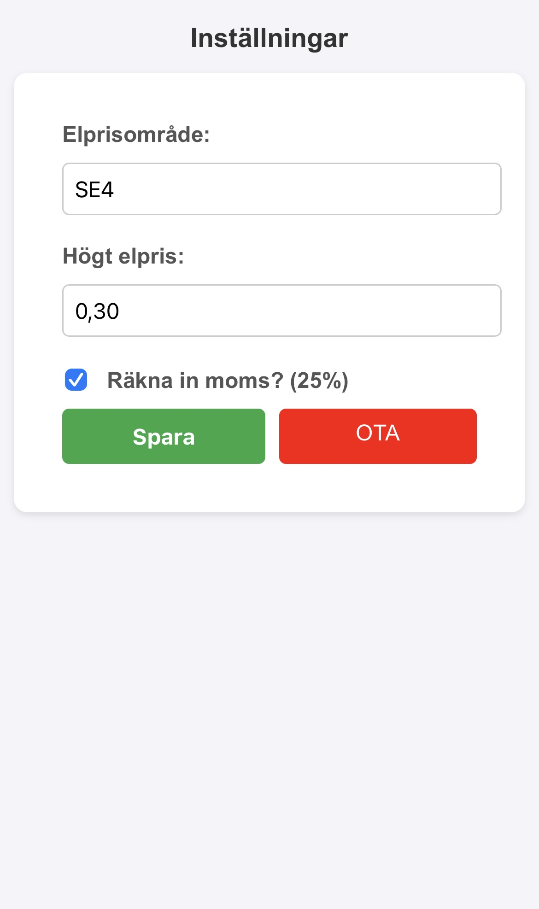

<h1 align="center">
   
  
</h1>

<h4 align="center">Eldisplay är en liten display som drivs av en ESP8266 och visar de aktuella elpriserna i Sverige.</h4>

  <a href="#vad-ar-eldisplay">•Vad är Eldisplay?</a> •
  <a href="#hur-man-installera">Hur man installerar</a> •
  <a href="#hårdvara">Hårdvara</a>

_README in [English](README-en.md)_

## Vad är Eldisplay?

Eldisplay föddes ur en enkel insikt: det kändes onödigt att behöva plocka upp mobiltelefonen för att kolla elpriser innan man använde apparater som tvättmaskiner eller diskmaskiner. Jag insåg att det borde finnas ett enklare sätt att hålla koll på priserna.

Därför skapades Eldisplay – en lösning som syftar till att förenkla processen för att övervaka elpriser. Genom att erbjuda till aktuella elpriser för den nuvarande timmen och de följande två timmarna. Det eliminerar behovet av att öppna en mobilapplikation varje gång.

Funktioner i Eldisplay:

* **Realtidspriser:** Visar aktuella elpriser för den aktuella timmen och de kommande två timmarna.
* **Regionsval:** Gör det möjligt för användare att konfigurera sitt aktuella elprisområde.
* **Webbgränssnitt:** Ett gränssnitt för enkel konfiguration.

## Hur man installerar

1. **Ladda ner .bin:**
   - Gå till [release](https://github.com/PhPersson/eldisplay/releases) och ladda ner den senaste `.bin`-filen för Eldisplay.

2. **Installera .bin:**
   - Använd [ESPHome Web](https://web.esphome.io/) för att ladda upp `.bin`-filen till din ESP8266.
   - Följ verktygets instruktioner för att välja rätt COM-port och ladda upp.

3. **Konfigurera enheten**
   - När uppladdningen är klar, anslut till Eldisplays AP.
   - Följ anvisningarna och anslut eldisplay till WiFi.
   - När du är ansluten till WiFi, gå till __eldisplay.local__ i valfri webbläsare för att konfigurera enheten.
   - Webbgränsnittet låter dig att ändra ditt _elprisområde, när elpriset skall anses som högt, om 25% moms_ skall räknas in i priset som visas

Webbgränsnitt           |  Eldisplay väntar på att slutföra konfigurering
:-------------------------:|:-------------------------:
  |  

## Hårdvara

1. **Hårdvara:**
   - ESP8266 mikrokontroller.
   - ILI9341 display.
   - Strömförsörjning för ESP8266 och displayen.
   - Jumperkablar för anslutningar.

